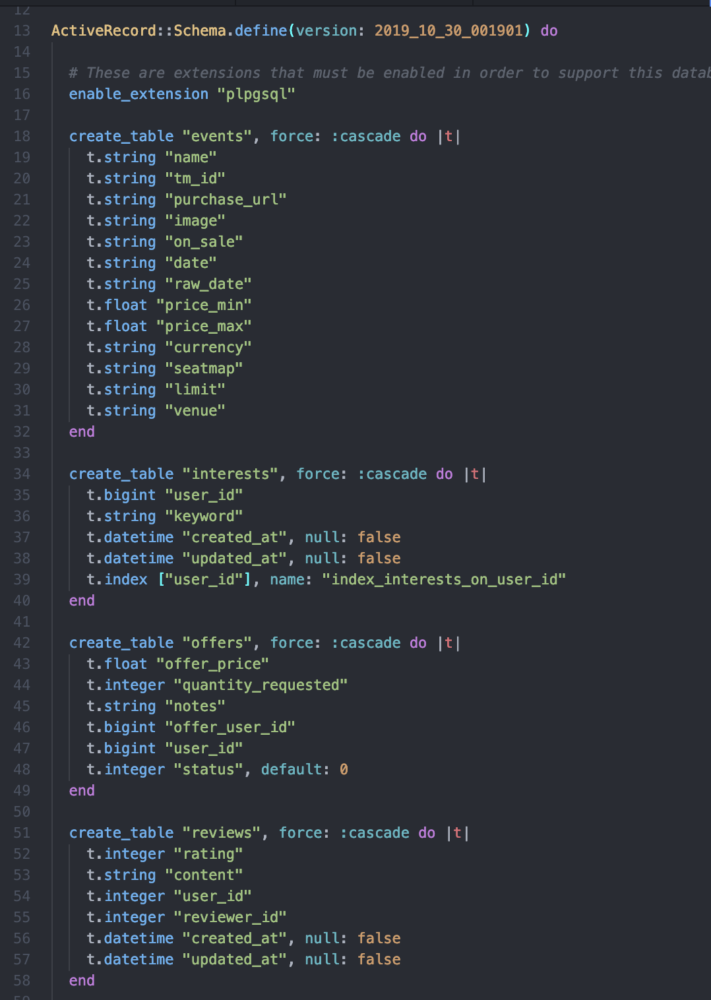

# README

This README would normally document whatever steps are necessary to get the
application up and running.

Things you may want to cover:

* Ruby version

* System dependencies

* Configuration

* Database creation

* Database initialization

* How to run the test suite

* Services (job queues, cache servers, search engines, etc.)

* Deployment instructions

* ...

# About Our Team

  

  We are four software engineering students at Turing School of Software & Design.
  This app is the product of a group project over 12 days 3/4 the way through our
  seven-month intensive technical education program. The idea came from a real-life
  struggle with Ticketmaster's on-sale process to obtain tickets to some of our favorite,
  very in-demand events. The solution we created is TicketTalk - a way for fans to help
  each other purchase tickets at face value instead of the overcharging of scalpers.

  TicketTalk is the combination of two Ruby apps communicating together to provide the end
  User Experience. First, we consumed the Discovery API from Ticketmaster with a Sinatra microservice.
  This gave us the opportunity to pull the exact event data we wanted to utilize in the Ruby on
  Rails application. That main app includes Google OAuth, PayPal payments, a native review system,
  and some difficult-to-implement JavaScript chat functionalities. Overall, we are very excited to
  present this end product and plan to continue enhancing development in the future.

# Database Schema
    

      
      
      

    

  

